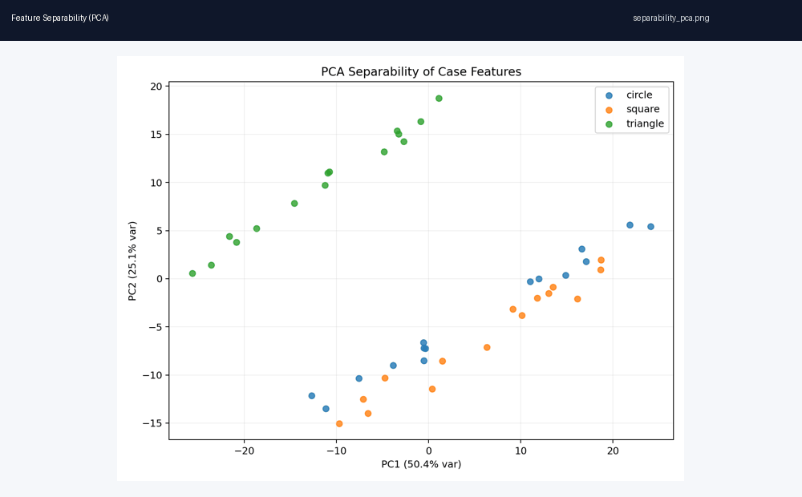
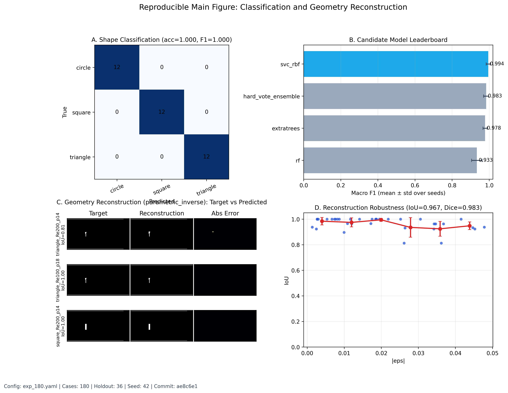
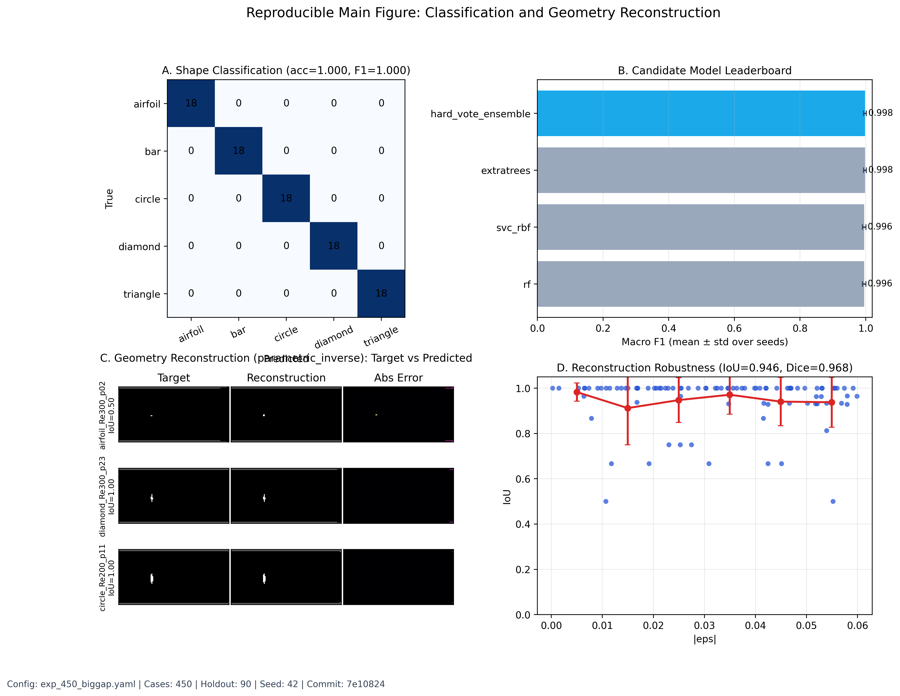
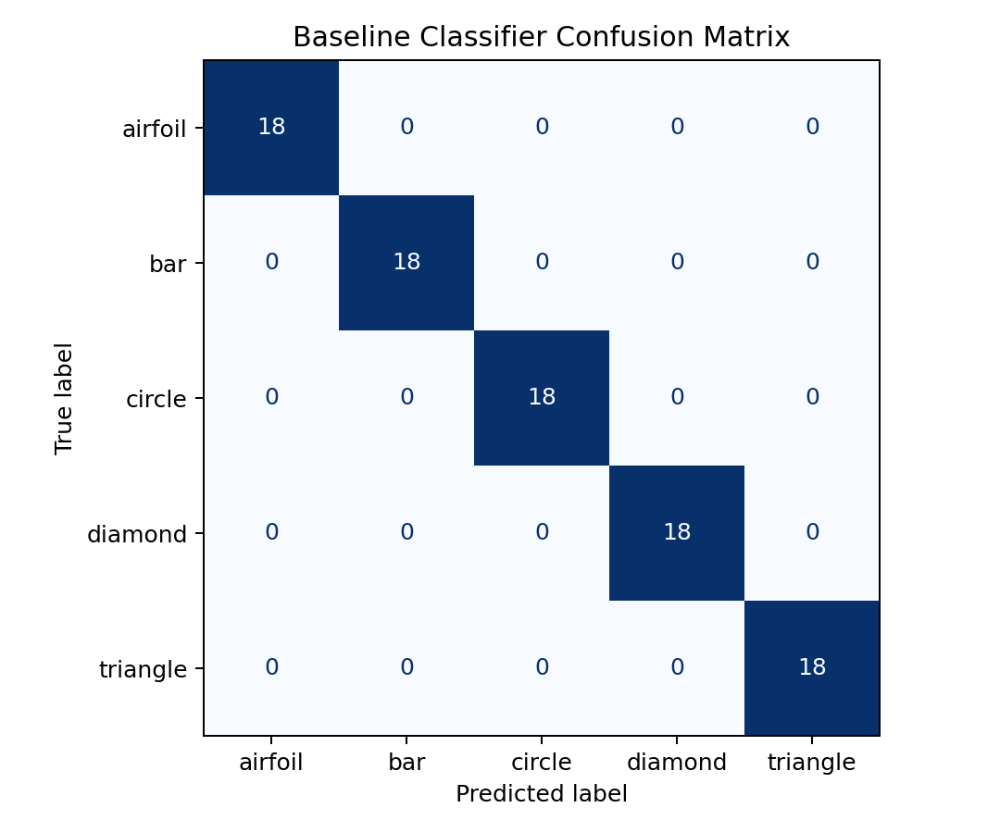
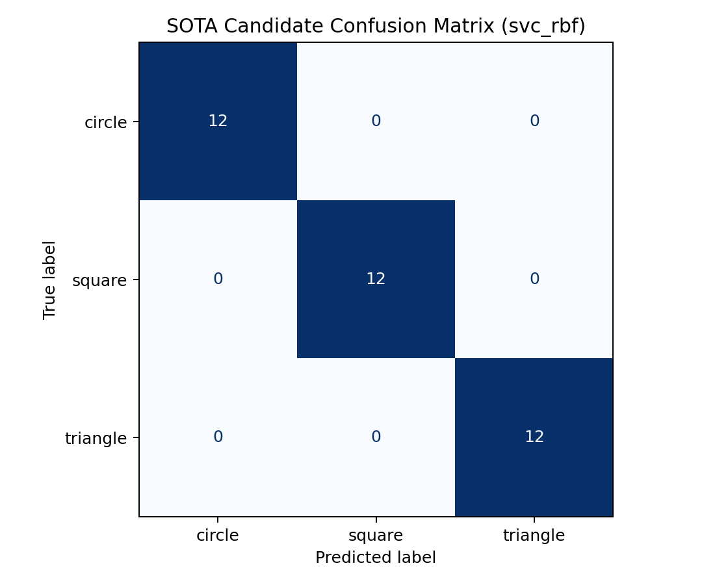
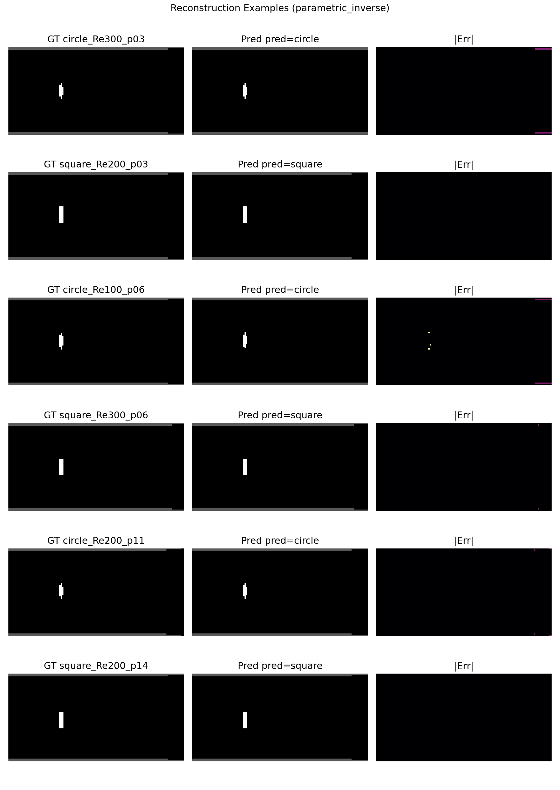
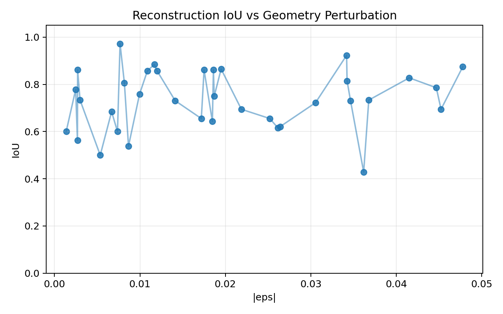
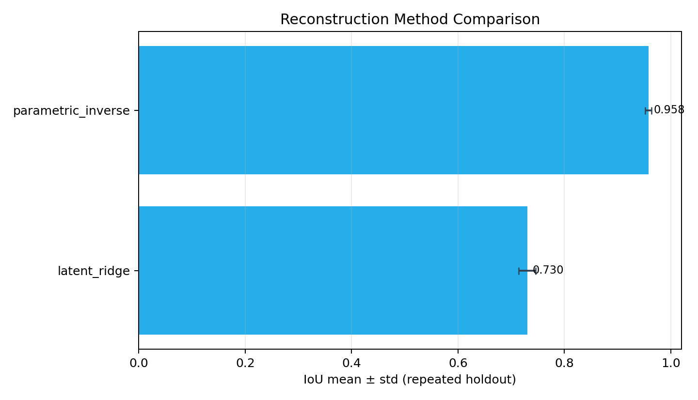
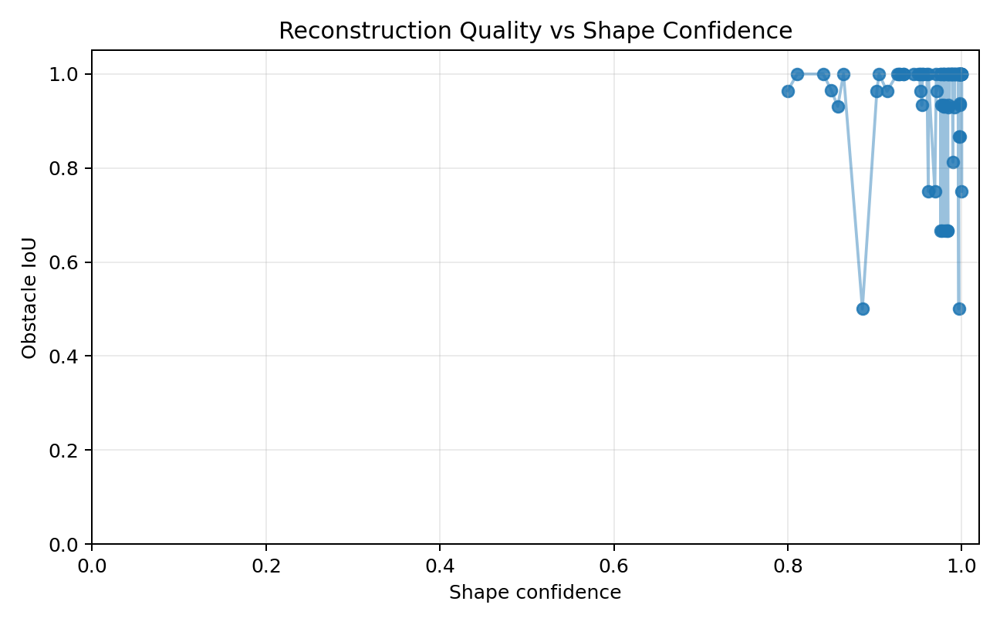
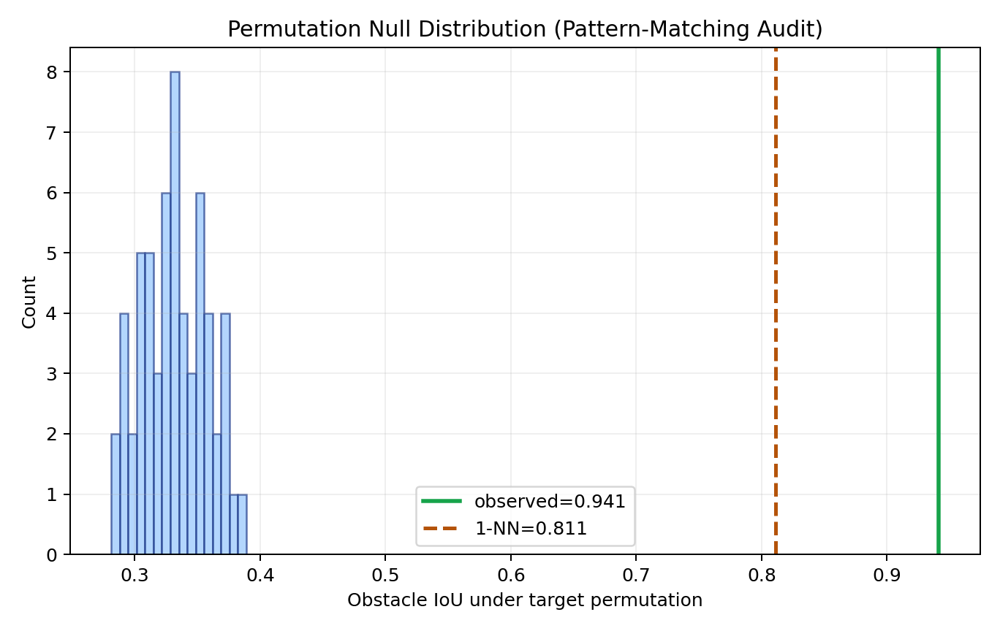

# Fluid Camera: CFD + ML End-to-End Pipeline

可复现实验仓库：在 2D 通道流中用出口截面探针速度 `u(t)` 识别上游障碍物形状（`circle/square/triangle`）。

## TL;DR

- 已完成大实验：`configs/exp_360_airfoil.yaml`，总计 `360 cases`（`circle/square/triangle/airfoil`）
- 分类：`SVC(RBF)` repeated holdout `acc=0.9861±0.0124`，seed=42 holdout `acc=0.9722`
- 重建：`parametric_inverse` repeated holdout `IoU=0.9340±0.0099`，seed=42 holdout `IoU=0.9404`
- 反模式匹配审计（120次置换）：`p=0.008264`，拒绝“纯模板匹配”假设
- 全流程可复现：`python -m sim.generate_dataset --config configs/exp_360_airfoil.yaml` 后续接 `train_sota/reconstruct/figure`

最新“放大形状差异”实验：`configs/exp_450_biggap.yaml`（`circle/triangle/airfoil/diamond/bar`，450 cases）
- 分类（repeated holdout）：`0.9978±0.0044`
- 重建（repeated holdout）：`IoU=0.9472±0.0050`, `mIoU3=0.9774±0.0020`
- 置换审计（60次）：`p=0.016393`

## 当前算法（你问的“基于什么算法”）

- 分类分支：
  `rf / extratrees / svc_rbf / hard_vote` 候选模型对比，自动选择最优模型并保存到 `models/sota.pkl`
- 重建分支：
  双方法 A/B 测试并自动择优
  1. `latent_ridge`：`PCA + Ridge` 直接像素回归（旧基线）
  2. `parametric_inverse`：`ExtraTreesClassifier(shape)` + `ExtraTreesRegressor(dy, eps)`，再调用几何渲染器生成图像（当前最优）
  3. 置信度审计：输出 `shape_confidence`，并在 `reconstruction_sanity.md` 用阈值（默认 `0.45`）标记潜在不可信样本

## 效果与可信度（你问的“怎么确保效果”）

数据配置：`configs/exp_360_airfoil.yaml`（360 cases，按 `(shape, Re)` 分层切分，5 个随机种子重复）

### 分类结果（`reports/sota_summary.md`）

| Metric | Value |
|---|---|
| Holdout (seed=42) accuracy | `0.9722` |
| Holdout (seed=42) macro F1 | `0.9721` |
| Repeated holdout accuracy | `0.9861 ± 0.0124` |
| Repeated holdout macro F1 | `0.9861 ± 0.0125` |
| Leave-One-Re-Out worst acc | `0.8750` (Re=100) |

### 重建结果（`reports/reconstruction_summary.md`）

| Method | IoU (mean±std) | Dice (mean±std) | MSE (mean±std) |
|---|---|---|---|
| `parametric_inverse` | `0.9340 ± 0.0099` | `0.9569 ± 0.0083` | `2.42e-4 ± 4.30e-5` |
| `latent_ridge` | `0.4402 ± 0.0143` | `0.5541 ± 0.0159` | `7.06e-4 ± 2.10e-5` |

已做的稳健性与泛化检查：
- 重复 holdout（多种子）而不是单次结果
- Leave-One-Re-Out（跨 Re 泛化）
- `|eps|` 扰动 sweep 曲线（鲁棒性）
- 同数据同切分下的新旧方法 A/B 对照
- 重建 sanity 对照（aligned vs random-pair）与低质量尾部统计（见 `reports/reconstruction_sanity.md`）
- 机器统计反模式匹配审计（置换检验 + 1NN模板检索 + 近重复检测，见 `reports/pattern_audit.md`）

## Visual Preview



## Reproducible Main Figure (Publication Style)



## Large Experiment Figure (With Airfoil)


## Large Experiment Figure (Big Shape Gap)



## Result Comparison

### A) Classification (真实标签 vs 预测结果)

Baseline confusion matrix:



SOTA candidate confusion matrix:



### B) Reconstruction (目标几何图像 vs 重建图像)

Ground truth / Prediction / Absolute error examples:



Reconstruction quality vs outlet perturbation (`IoU` vs `|eps|`):



Method comparison (`parametric_inverse` vs `latent_ridge`):



Sanity: shape confidence vs reconstruction IoU:



Pattern audit: permutation null distribution:



后端支持：
- `synthetic`（默认）：合成非定常尾迹信号，保证无 CFD 环境也能完整跑通。
- `openfoam`：OpenFOAM 自动化适配层（模板 + 命令封装 + probes 解析）。

## 1. Environment

- Python 3.11
- Dependencies: `numpy scipy pandas scikit-learn matplotlib pyyaml`

```bash
python -m venv .venv
source .venv/bin/activate
pip install -r requirements.txt
```

## 2. One-Command Workflow

### Dataset + Features

```bash
make dataset
```

默认使用 `configs/default.yaml`（小数据集，`3*3*3=27` cases）。

### Train + Reports

```bash
make train
```

### Train SOTA candidate (model search + best model export)

```bash
make sota
```

### Geometry image reconstruction (inverse problem)

```bash
make reconstruct
```

### Pattern-Matching Audit

```bash
make audit CONFIG=configs/exp_360_airfoil.yaml AUDIT_N_PERM=120
```

### Build preview GIF

```bash
make gif
```

### Build publication main figure

```bash
make figure CONFIG=configs/exp_180.yaml
```

### 45-case 扩展实验

```bash
make dataset CONFIG=configs/exp_45.yaml
make train CONFIG=configs/exp_45.yaml
```

### 挑战性 45-case 压测（更强扰动）

```bash
make dataset CONFIG=configs/challenging_45.yaml
make train CONFIG=configs/challenging_45.yaml
make reconstruct CONFIG=configs/challenging_45.yaml
```

### 更大规模实验（180 cases）

```bash
make dataset CONFIG=configs/exp_180.yaml
make train CONFIG=configs/exp_180.yaml
make reconstruct CONFIG=configs/exp_180.yaml
```

### 大实验 + 机翼型（360 cases）

```bash
python -m sim.generate_dataset --config configs/exp_360_airfoil.yaml
python -m extract.build_features --config configs/exp_360_airfoil.yaml
python -m ml.train_sota --config configs/exp_360_airfoil.yaml
python -m ml.reconstruct --config configs/exp_360_airfoil.yaml
python -m ml.audit_shortcut --config configs/exp_360_airfoil.yaml --n_perm 120
python scripts/make_publication_figure.py --config configs/exp_360_airfoil.yaml --output reports/figure_main_airfoil_360.png
```

该实验的归档报告：
- `reports/summary_exp_360_airfoil.md`
- `reports/sota_summary_exp_360_airfoil.md`
- `reports/reconstruction_summary_exp_360_airfoil.md`
- `reports/reconstruction_sanity_exp_360_airfoil.md`
- `reports/reconstruction_case_metrics_exp_360_airfoil.csv`
- `reports/pattern_audit_exp_360_airfoil.md`
- `reports/pattern_audit_null_exp_360_airfoil.csv`

### 大差异形状实验（450 cases）

```bash
python -m sim.generate_dataset --config configs/exp_450_biggap.yaml
python -m extract.build_features --config configs/exp_450_biggap.yaml
python -m ml.train_sota --config configs/exp_450_biggap.yaml
python -m ml.reconstruct --config configs/exp_450_biggap.yaml
python -m ml.audit_shortcut --config configs/exp_450_biggap.yaml --n_perm 60
python scripts/make_publication_figure.py --config configs/exp_450_biggap.yaml --output reports/figure_main_biggap_450.png
```

该实验的归档报告：
- `reports/summary_exp_450_biggap.md`
- `reports/sota_summary_exp_450_biggap.md`
- `reports/reconstruction_summary_exp_450_biggap.md`
- `reports/pattern_audit_exp_450_biggap.md`
- `reports/figure_main_biggap_450.png`

## 3. Required Outputs

- Raw probe series: `data/raw/<case_id>/probes.csv`
- Case metadata: `data/raw/<case_id>/metadata.json`
- Run manifest: `data/raw/manifest.csv`
- Metadata index: `data/raw/index.csv`
- Features table: `data/features/features.csv`
- Model: `models/baseline.pkl`
- SOTA candidate model (best from model search): `models/sota.pkl`
- Reconstruction model: `models/reconstructor.pkl`
- Reports:
  - `reports/pipeline_overview.gif`
  - `reports/separability_pca.png`
  - `reports/spectra_examples.png`
  - `reports/confusion_matrix.png`
  - `reports/robustness_sweep.png`
  - `reports/holdout_stability.png`
  - `reports/holdout_repeats.csv`
  - `reports/summary.md`
  - `reports/model_leaderboard.csv`
  - `reports/sota_repeats.csv`
  - `reports/confusion_matrix_sota.png`
  - `reports/robustness_sweep_sota.png`
  - `reports/sota_summary.md`
  - `reports/reconstruction_examples.png`
  - `reports/reconstruction_iou_vs_eps.png`
  - `reports/reconstruction_method_comparison.png`
  - `reports/reconstruction_method_leaderboard.csv`
  - `reports/reconstruction_repeats.csv`
  - `reports/reconstruction_summary.md`
  - `reports/reconstruction_case_metrics.csv`
  - `reports/reconstruction_sanity.md`
  - `reports/reconstruction_confidence_vs_iou.png`
  - `reports/pattern_audit.md`
  - `reports/pattern_audit_null.csv`
  - `reports/pattern_audit_nn_distance.csv`
  - `reports/pattern_audit_null_hist.png`
  - `reports/figure_main_airfoil_360.png`
  - `reports/figure_main_biggap_450.png`
  - `reports/figure_main_airfoil_360.pdf`
  - `reports/figure_main_airfoil_360.json`

## 4. Data Schema

### `probes.csv`

Columns:
- `time`
- `u_000 ... u_031` (default `N=32`)

### `metadata.json`

Includes:
- case identifiers: `case_id`, `shape`, `Re`, `dy`, `eps`, `seed`
- geometry fields: `H, d, x0, y0, L_in, L_out`
- probe layout: count, `x`, all `y` positions
- sampling window: `dt`, `n_samples`, `t_start`, `t_end`
- backend and file references

### `features.csv`

Per case row:
- labels/meta: `case_id, shape, Re, dy, eps, seed`
- per-probe: `mean/std/f_peak/a_peak/band_0..band_5`
- cross-probe: adjacent xcorr peak and lag stats
- POD energy ratios: `pod_energy_1..pod_energy_5`

## 5. Modeling and Evaluation

- Baseline model: `RandomForestClassifier`
- Holdout split: stratified by `(shape, Re)`
- Multi-seed stability: repeated holdout across `ml.repeat_seeds`
- Generalization test: Leave-One-Re-Out
- Metrics: `accuracy`, `macro F1`, confusion matrix
- Robustness sweep: `|eps|` bin vs cross-validated accuracy

## 6. Switching Backend

### Synthetic backend (default)

```bash
make dataset SOLVER=synthetic
```

### OpenFOAM backend

```bash
make dataset SOLVER=openfoam
```

OpenFOAM path uses:
- template case: `sim/templates/openfoam_case/`
- adapter: `sim/openfoam_adapter.py`
- geometry hook: `sim/templates/openfoam_case/scripts/build_geometry.py`

If OpenFOAM commands are not in `PATH`, dataset generation fails per-case and logs errors while pipeline remains resumable.

## 7. Project Structure

- `sim/`: case generation, solver adapters, OpenFOAM orchestration, manifests/index
- `extract/`: feature extraction from probe time series
- `ml/`: training, evaluation, report plots, summary writing
- `configs/`: experiment YAMLs
- `data/`: raw data and features
- `reports/`: plots and markdown summary

## 8. Reproducibility and Failure Handling

- fixed random seed in config
- case-level retries in dataset generation
- failures do not stop whole run
- failed cases + errors are captured in:
  - `data/raw/manifest.csv`
  - `reports/summary.md`
- logs:
  - `logs/dataset.log`
  - `logs/features.log`
  - `logs/train.log`

## 9. Extending the Pipeline

- Add new shape:
  - synthetic: add `simulation.synthetic.shape_params` and spatial mode in `sim/synthetic_solver.py`
  - OpenFOAM: extend geometry hook/meshing templates
- Change probe layout: modify `simulation.probes_n`
- Add new features: extend `extract/feature_engineering.py`
- Try new models: extend `ml/train.py`

## 10. Borrowed Architecture Notes

This repository intentionally borrows **architecture/process ideas** from prior open repositories while re-implementing all code in this repo.
See:
- `docs/ARCHITECTURE_REFERENCES.md`
